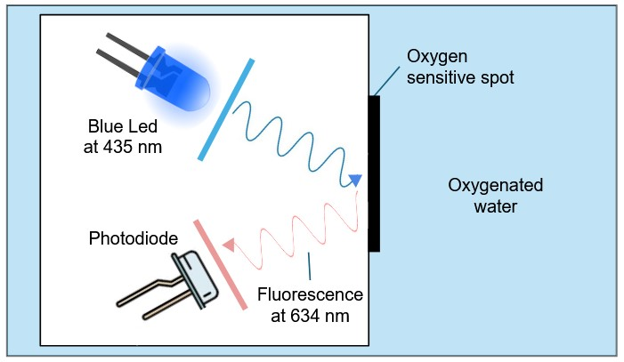
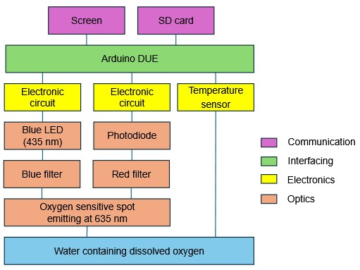

<p align="center">
  
</p>

# Dissolved-oxygen-sensor

## Description

This project aims to develop a low-cost optode for measuring dissolved oxygen concentration in water, a key indicator of the health of marine environments. The project is conducted by students in photonics from Enssat in collaboration with the European Institute for Marine Studies (IUEM) and is part of an open-source initiative to facilitate easy and cost-effective replication of the device.

This GitHub repository contains all the necessary resources and instructions for understanding and making the device.

The document [Optode overview](Optode_overview.pdf) aims to provide an overview of the technical aspects of our sensor.

## Features

## Principle of dissolved oxygen sensor

<p align="center">
  
</p>
The measurement principle is based on the use of a luminophore. An emitting blue light is absorbed by a sensitive foil exposed to water. Then it returns red light through fluorescence. By measuring the phase shift between the blue and red signal, the concentration of dissolved oxygen can be determined.

## Functionality

<p align="center">
  
</p>

The Arduino DUE coordinates the entire system. To ensure speed and accuracy, the microcontroller uses synchronous detection. It drives a blue LED (435 nm) for excitation and detects the resulting fluorescence at 635 nm using a photodiode (isolated by a red filter). A temperature sensor is installed for measurements. Finally, the data is displayed on the OLED screen and saved to the MicroSD card.

## Components

The main components are:

| Component | Description |
|-----------|-------------|
| LED | Light Emitting Diode for blue excitation |
| Oxygen sensitive foil | Emits red fluorescence linked to the oxygen concentration |
| Photodiode | Detects red fluorescence |
| Arduino | Microcontroller for processing |
| Temperature Sensor | Measures the temperature |
| OLED Screen | Displays values |
| MicroSD Card Shield | Saves data to a MicroSD card |

For a detailed list of components with the references, please refer to the [Components List](hardware/components.md).

## Construction of the device : OXYMETER

### Prerequisites

- Arduino IDE
- Electronic components
- Soldering equipment
- 3D printer
- Laser cutter

### Installation Steps

1. **Clone the Repository:**

   ```bash
   git clone https://github.com/EnssatPhotonicsProjects/Dissolved-oxygen-sensor.git
   ```

### Assembling the dissolved oxygen sensor

Follow the steps of the [assembly guide](assembly_guide.md) to build the dissolved oxygen sensor.

## Avenues for Improvement

- ...

Contributions are welcomed to improve these points.

## To contribute

Contributions to this project are welcomed. To contribute, follow these steps:

1. **Fork the repository** and create your branch:

   ```bash
   git checkout -b my-new-feature
   ```

2. **Make your changes** and test them thoroughly.

3. **Document your changes** in the [EXTERNAL_CONTRIBUTIONS](EXTERNAL_CONTRIBUTIONS.md) file. Begin the file with your name, location and date.

4. **Submit a Pull Request** with a detailed description of your changes.

## Contributors

Team 2025-2026 :
- Arthur Allaeys (IntricationQuantique)
- Elisa Charron (Quazou54)
- Brice Chupin (bricechup)
- Léon Dolaine
- Constant Ekpo
- Ethan Geffroy
- Nathan Maës
- Alexandre Martin-Lefèvre
- Adam Monzon
- Lucile Pointud
- Sean Swidurski

## Acknowledgments

The authors warmly thank Laurent Bramerie, Thierry Chartier, Antoine Courtay supervisors of the project at Enssat, Philippe Laborie (Laboratoire de physique corpusculaire, Caen, France) and Etienne Poirier (IUEM, Plouzané, France), members of the steering committee, for their advice and support throughout the project. 

Special thanks to Etienne Poirier for giving the idea of the project, helping us, trusting us and welcome us at IUEM in the last days of the project.

Authors are also very grateful to Pierre Guilleme teacher at Enssat, and Jean-Philippe Lesault, technician at Enssat, for their advice and technical support. Specific thanks to Yvan Guilloit, in charge of the MakerSpace at IUT de Lannion, France, for his help in the integration of the device in the waterproof box.

The dissolved oxygen sensor project started in september 2025 with a first team of Enssat students.

## License

This project is licensed under [CC BY-SA 4.0]. Please see the [LICENSE](LICENSE.md) file for more details.
