# Assembly Guide for Support Structures

This guide provides detailed instructions on how to assemble the Dissolved-oxygen-sensor structures.

## Prerequisites

Before starting the assembly process, ensure you have the following tools and components ready:

- Components from the [Components List](hardware/components.md)
- PVC glue
- Sandpaper
- PVC stripper
- Laser cutter
- Screws, nuts, washers, spacers
- Paper towel or rag
- Wires (red and black)
- Soldering station

## Step 1 : Assemble the LEDs and photodiode support

Start by soldering wires to the LEDs and photodiode terminal. Pay attention to the polarity of the terminals : you can solder a red wire on the + terminals of the LED and the cathode terminal of the photodiode. A black wire can be soldered on the - terminals of the LEDs and on the anode of the photodiode.

When this is done, you can assemble following components :
- Blue LED
- Photodiode
- (Red filter : 19 x 18 mm) X2
- [3D printed support](Ready_to_laser_cut_LED-photodiode-support.stl)

  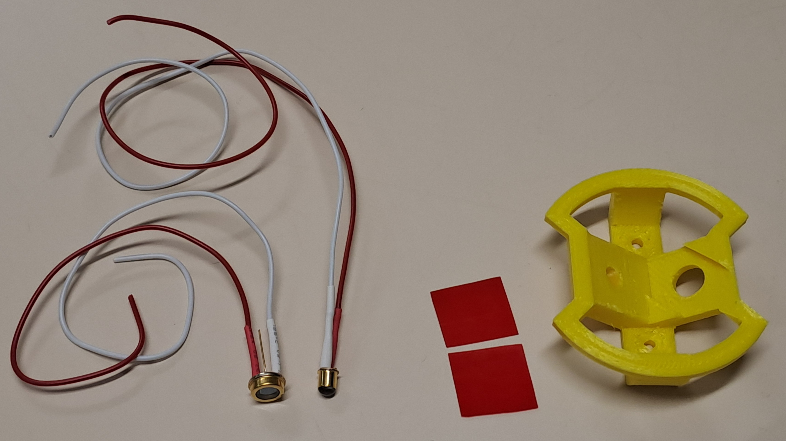

1. Position the LED and the photodiode in their location. If they do not fit, you can lightly file the inside of the holes. The components must be perfectly held by the support and must not move. The wires must come out of the back of the bracket. You can add small pieces of adhesive tape to the edges of the LED and the photodiode to ensure they do not slip out of the holders.

  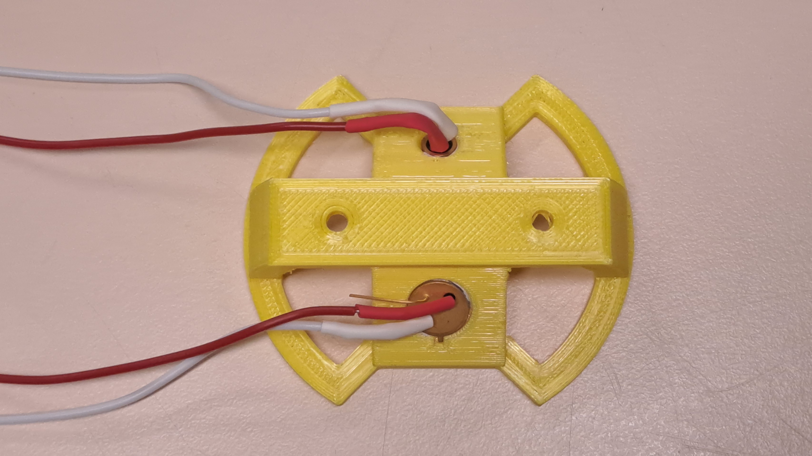

2. Add the two pieces of red filter. You can slide them in front of the photodiode location.

  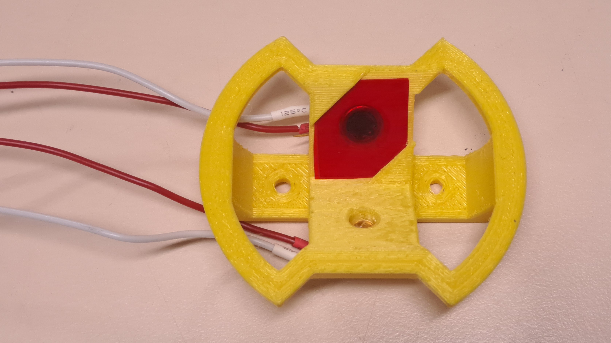

## Step 2 : Assemble the internal structure

The materials required for this step are :
- The Arduino DUE board
- The PCB board with all the electronic components (Screen, SD Card shield, temperature sensor)
- 3 screws, diameter 3 mm, length 5?? mm + 6 nuts
- 16 spacers of 30 mm
- 4 countersunk screw, diameter 3 mm, length 8?? mm + nuts + washers
- 2 screws, diameter 3 mm, length 10?? mm + nuts 
- 4 screws, diameter 2 mm, length ?? mm + 8 nuts + washers
- A powerbank (100 x 50 x 2.5) mm max
- A output power supply and angled USB output cable
- The LED and photodiode AD support made in the previous step
- PMMA sheet or wood, thickness 3 mm
- PMMA sheet, thickness 1.5 mm
- Screwdrivers
- Laser cutter

  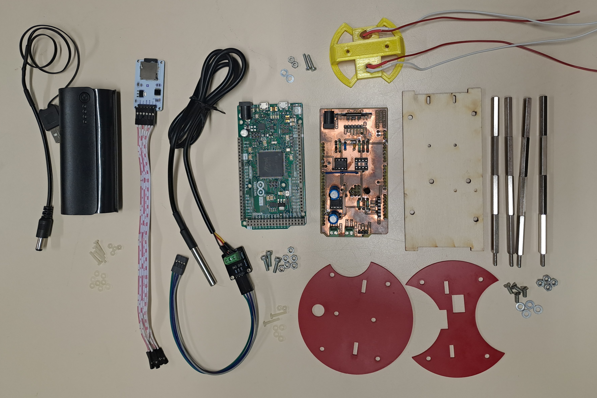

1. Cut the structure in the PMMA sheets with the laser cutter. In 1.5 mm PMMA, cut the [plates](hardware/Ready_to_laser_cut_plates.svg). In 3 mm PMMA, cut the [mount](hardware/Ready_to_laser_cut_mount.svg).

  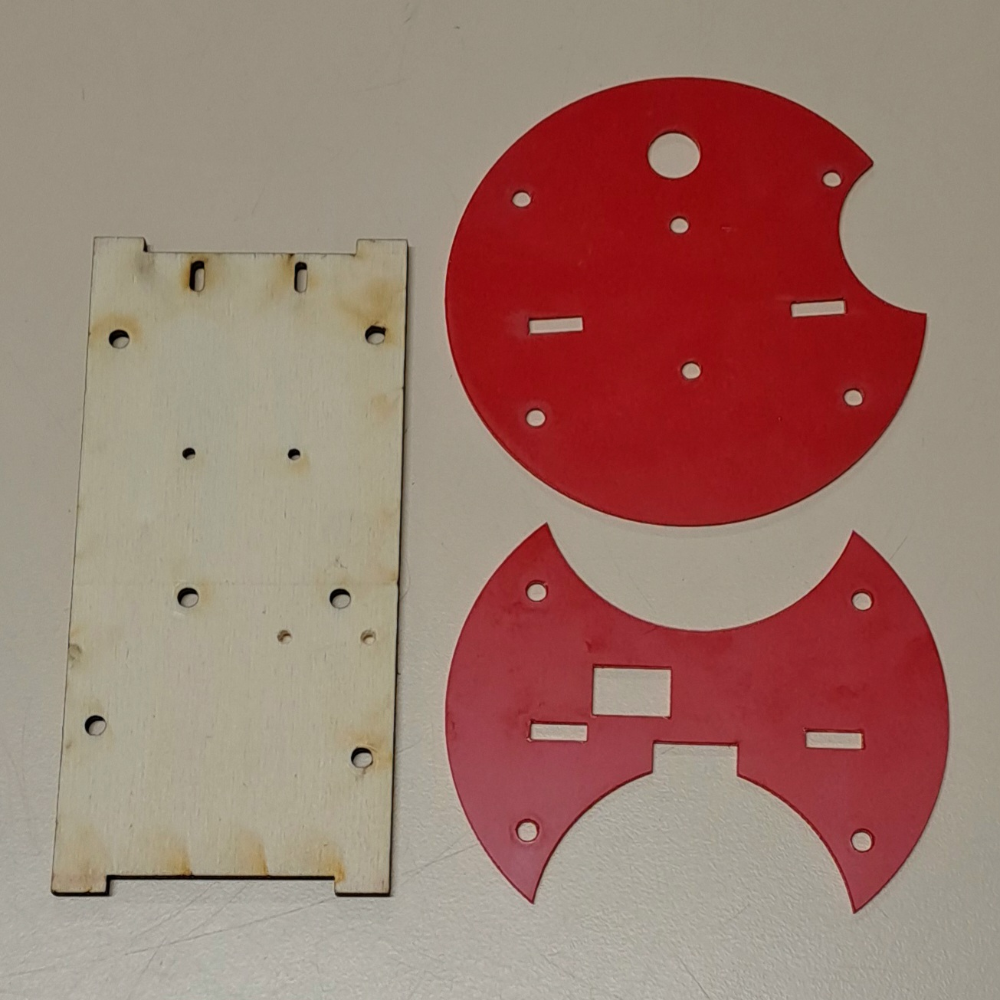

2. Screw 3 screws and nuts to the Arduino board, as shown in the photo below. Connect the PCB to the Arduino board.

  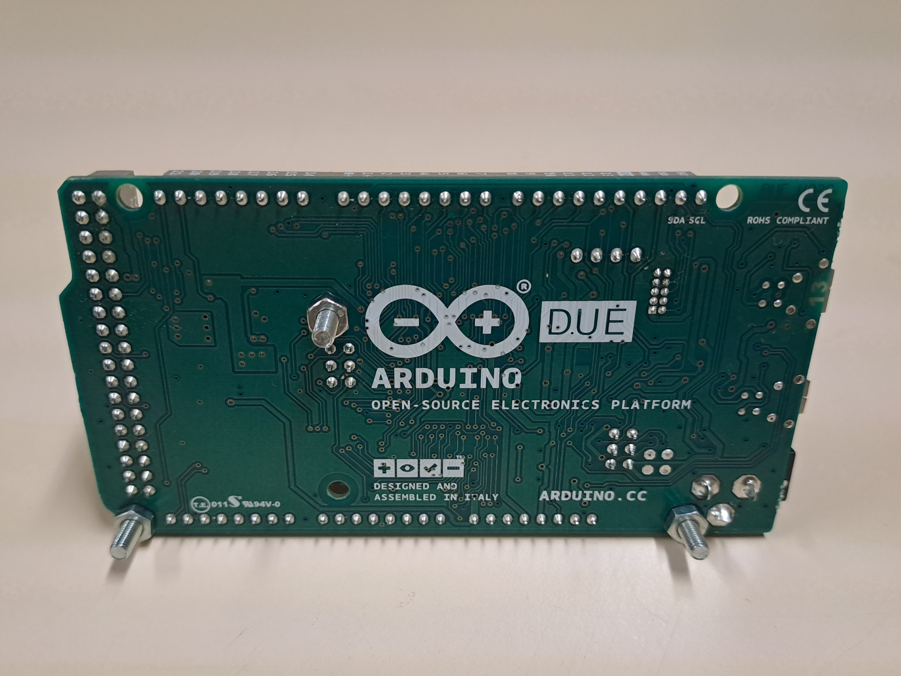 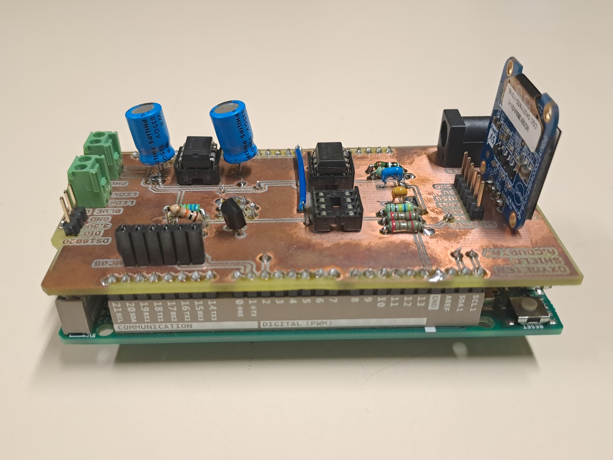

3. Take the face plate. Locate the side where the Arduino board goes. On the opposite side, screw the SD Card shield. Put a nuts between the shield and the plate.

  

4. Screw the Arduino board on the opposite face of the plate.

  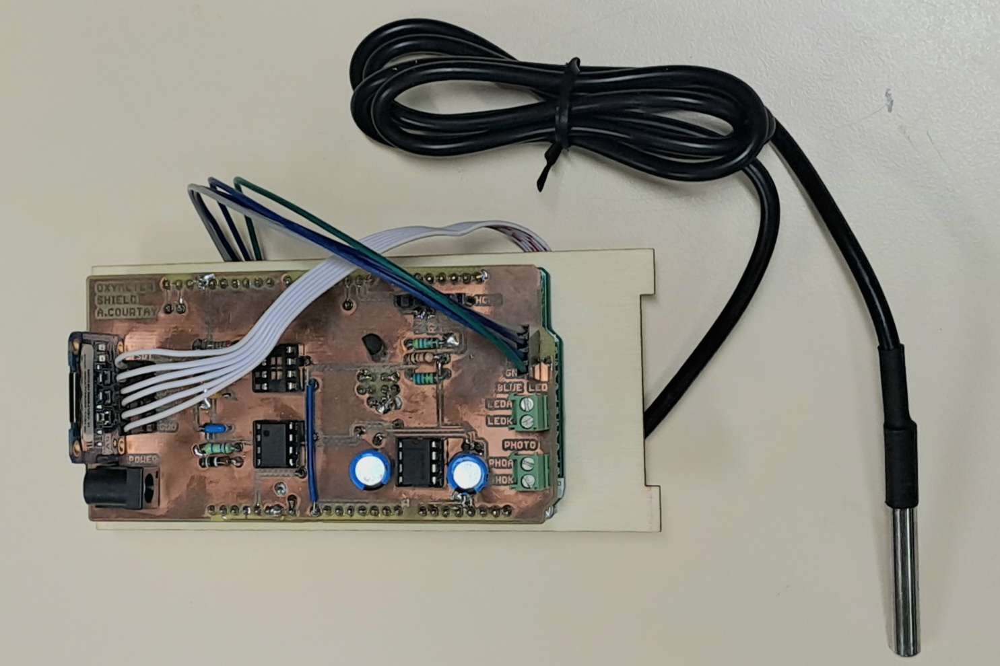 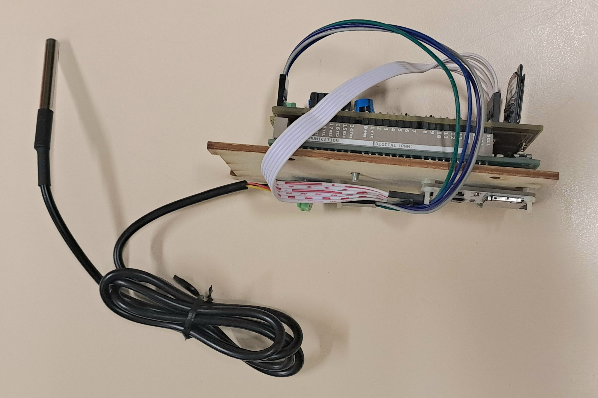

5. Take the bottom plate and the LED and photodiode support. Screw this support under the bottom plate. Make sure that the large hole in the plate is on the same side as the wires. Pass the wires through the hole.

  

6. Screw the 30 mm spacers into the four corners.

  

7. Screw the LED and photodiode wires into terminal strips of the PCB. Make sure to connect the cathode and anode to the correct terminals.

  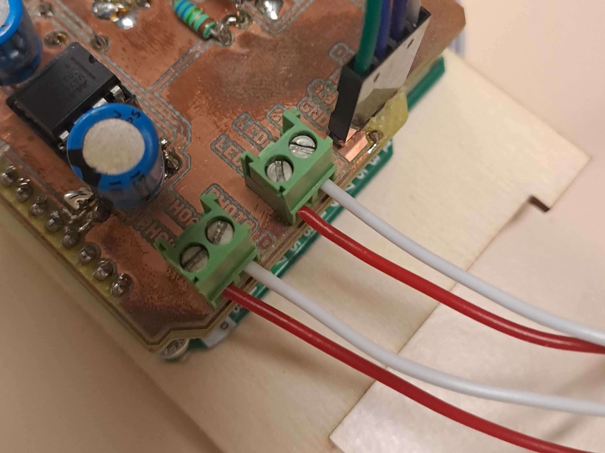

8. Screw the 30 mm spacers into the four corners of the middle plate and put the middle structure, bend the wires of the LED and photodiode, without moving LED and photodiode.

  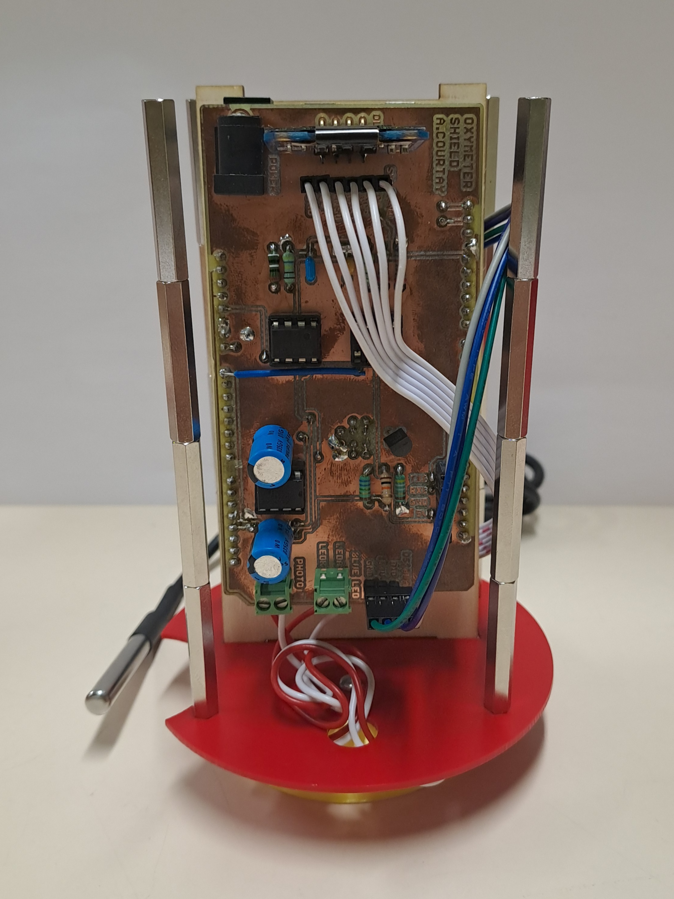

9. Screw the top plate.

  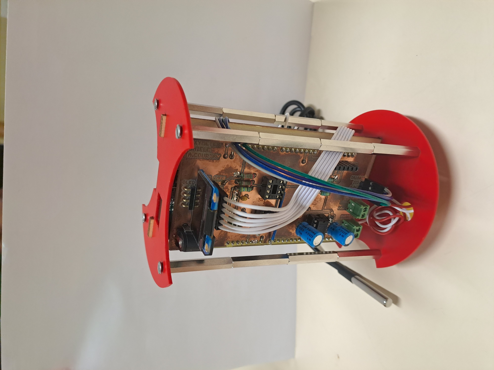

10. Put the powerbank and the alimentation cable. Fasten it to the spacers with a cable tie.

  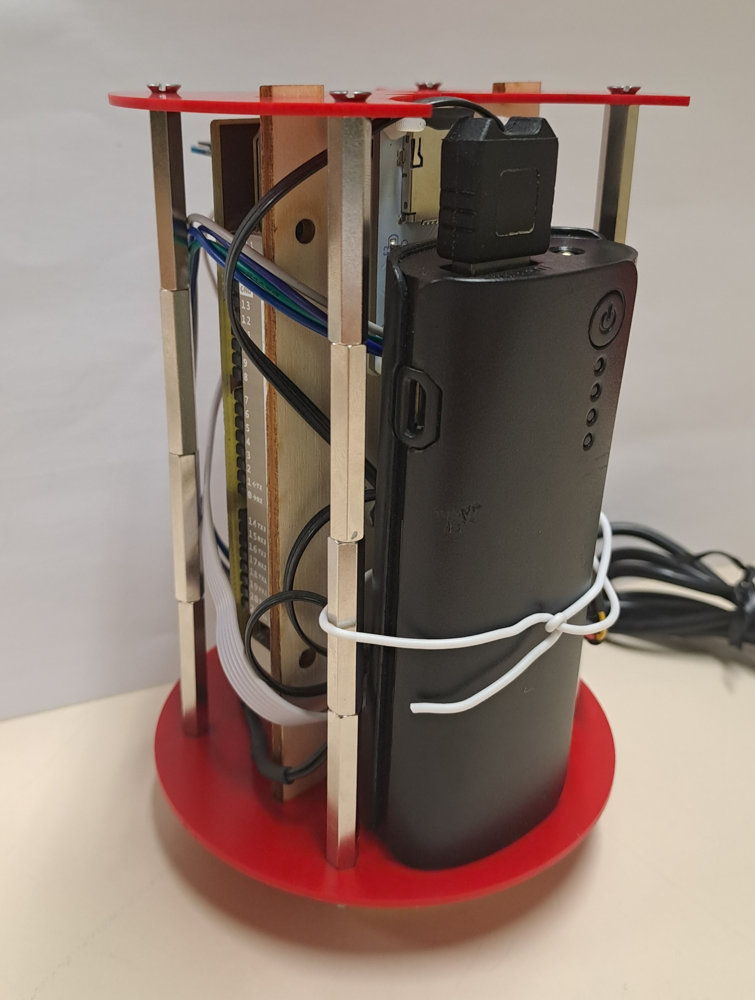

## Step 3 : Assemble the waterproof box

In this step, you will need :
- PVC sleeve
- Two PVC inspection plugs
- transparent PMMA plate
- cable gland (taille ??)
- PVC glue
- Sandpaper
- PVC stripper
- Laser cutter
- Paper towel or rag

## Step 4 : Assemble the fluorometer

Slide the internal structure into the box. It must be at the bottom and must not move. Switch on the battery, and close the box.

